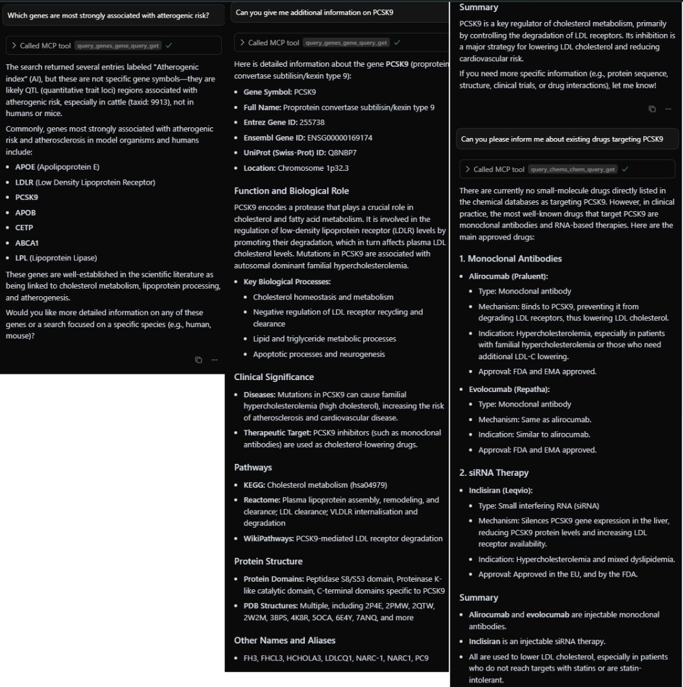
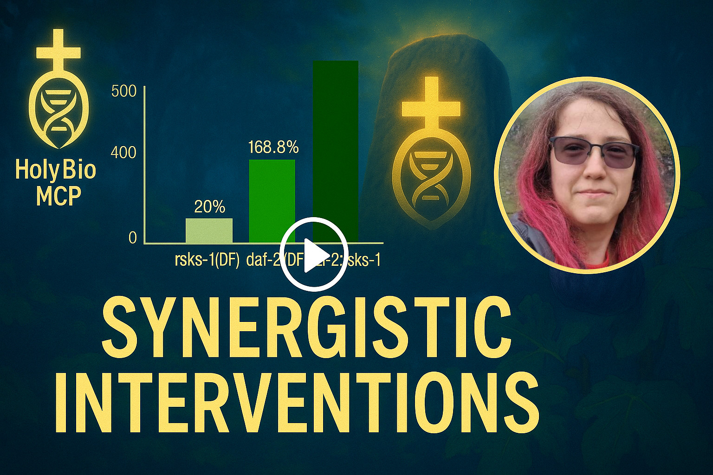

# Holy Bio MCP: A Unified MCP Framework for Bioinformatics Research

<div align="center">
  
  
  [](https://modelcontextprotocol.io)
  [](https://github.com/longevity-genie)
  [](https://github.com/longevity-genie)
</div>

---

__Developed during [Bio x AI Hackathon 2025](https://bio-x-ai-berlin.devfolio.co/overview)__

## 🎯 Our Mission

Holy Bio MCP is a unified framework born during Bio x AI Hackathon-2025 from our practical experience building LLM-powered agents at the **Longevity Genie project**, **IBIMA (Institute for Biostatistics and Informatics in Medicine and Ageing Research)**, and the **Systems Biology of Aging Group**. Our goal is to make life easier for researchers by providing a suite of specialized, interoperable tools that seamlessly integrate into AI-driven IDEs (like Cursor, Windsurf), chat clients (like Anthropic's Claude Desktop), and serve as foundational building blocks for complex agentic workflows (using  ElizaOS, Just-Agents, AutoGen, etc.).

This project aggregates several powerful, standalone MCP servers into a single, cohesive ecosystem for advanced bioinformatics and longevity research, **including a native ElizaOS plugin** for building autonomous research agents.

## What is the Model Context Protocol (MCP)?

MCP is a protocol designed to bridge the gap between Large Language Models (LLMs) and specialized, domain-specific tools and databases. It provides a standardized way for AI assistants and agents to access complex functionalities through structured, type-safe interfaces.

If you want to understand MCP in more detail and learn how to use it effectively, we recommend these resources:

- **DeepLearning.AI Course**: [MCP: Build Rich-Context AI Apps](https://www.deeplearning.ai/short-courses/mcp-build-rich-context-ai-apps-with-anthropic/)
- **Official Documentation**: [Model Context Protocol Website](https://modelcontextprotocol.io)
- **Community**: Search for "Model Context Protocol" on YouTube and other platforms for tutorials and discussions.

## 🔬 Real-World Example in Action

Here's a real conversation (that you can easily reproduce yourself as all MCP-es are working and covered with tests) showing Holy Bio MCP servers working together to answer complex research questions, demonstrating the power of this integrated approach:

<div align="center">
  
</div>

### 🎬 Video Demo

Here is a video demo of Holy-Bio-MCP, this time including synergistic genetic interventions and small molecules:

<div align="center">
  <a href="https://youtu.be/U9U06-YuuIg?si=xKhjQg-UzG7Sa3Rg">
    
  </a>
</div>

---

## 🛠️ Included MCP Servers & Integration Tools

This framework unites the following specialized MCP servers and integration tools. Each is a powerful tool on its own, but together they form a comprehensive research platform.

### Integration Tools
- **[biostratum-eliza](./biostratum-eliza)**: An ElizaOS plugin that enables autonomous AI agents to seamlessly connect to and utilize all the MCP servers below, providing a unified interface for building complex agentic workflows in bioinformatics research.

### MCP Servers
- **[gget-mcp](https://github.com/longevity-genie/gget-mcp)**: A powerful bioinformatics toolkit for genomics queries and analysis, wrapping the popular `gget` library.
- **[opengenes-mcp](https://github.com/longevity-genie/opengenes-mcp)**: A queryable database for aging and longevity research from the OpenGenes project.
- **[synergy-age-mcp](https://github.com/longevity-genie/synergy-age-mcp)**: A database of synergistic and antagonistic genetic interactions in longevity from SynergyAge.
- **[biothings-mcp](https://github.com/longevity-genie/biothings-mcp)**: Access to BioThings.io APIs for comprehensive gene, variant, chemical, and taxonomic data.
- **[pharmacology-mcp](https://github.com/antonkulaga/pharmacology-mcp)**: Access to the Guide to PHARMACOLOGY database for drug, target, and ligand information.

After the hackathon we also added:

- **[futurehouse-mcp](https://github.com/winternewt/futurehouse_mcp) to use future-house prediction models
- **[addgene-mcp](https://github.com/longevity-genie/addgene-mcp) to search plasmids (note: alpha stage)
- **[boltz-mcp](https://github.com/longevity-genie/boltz-mcp) to run Boltz structure predictions (note: alpha stage)
- **[benchling-mcp](https://github.com/longevity-genie/benchling-mcp) to interact with 
Bencling API (note: alpha stage)
- and many others

## Server Capabilities & Example Questions

Instead of just listing functions, here's a look at the kind of research questions you can answer with each server.

<details>
<summary><h3>1. 🔬 <code>gget-mcp</code>: Genomics & Sequence Analysis Toolkit</h3></summary>

<div align="center"></div>

Provides a rich set of tools for sequence analysis, functional genomics, and structural biology.

**Example Research Questions:**
- "Find information about the human *TP53* gene and get its protein sequence."
- "Perform enrichment analysis for a set of cancer-related genes: *TP53, BRCA1, BRCA2, ATM, CHEK2*."
- "Get the 3D structure information for the protein encoded by the *EGFR* gene from AlphaFold."
- "Find mutations in the COSMIC database for the *PIK3CA* gene."
- "Perform a BLAST search with the DNA sequence 'ATGGCGCCCGAACAGGGAC' to identify its origin."
- "Align multiple protein sequences to find conserved regions."
</details>

<details>
<summary><h3>2. 🕰️ <code>opengenes-mcp</code>: Aging & Longevity Genetics</h3></summary>

<div align="center"></div>

A queryable SQL database focused on the genetics of aging and longevity.

**Example Research Questions:**
- "Which genetic interventions extended the lifespan of mice the most?"
- "What polymorphisms in *FOXO3* are associated with human longevity?"
- "Which hallmarks of aging are associated with the *KL* (Klotho) gene?"
- "Are there any liver-specific interventions that increase lifespan in mice?"
- "Find genes that are associated with both longevity in human studies and have lifespan-extending effects in model organisms."
</details>

<details>
<summary><h3>3. 🔄 <code>synergy-age-mcp</code>: Synergistic & Antagonistic Genetic Interactions in Longevity</h3></summary>

<div align="center"></div>

A curated database containing experimentally validated data on genetic interventions affecting lifespan across multiple model organisms, focusing on synergistic, antagonistic, and epistatic interactions between genetic interventions.

**Example Research Questions:**
- "Which genetic interventions show the strongest synergistic effects in *C. elegans*?"
- "What is the relationship between *daf-2* and *daf-16* mutations in C. elegans longevity?"
- "How do insulin signaling pathway interventions compare between worms, flies, and mice?"
- "Which genetic combinations show antagonistic interactions that reduce lifespan benefits?"
- "How do caloric restriction mimetics interact with other longevity interventions?"
</details>

<details>
<summary><h3>4. 🧬 <code>biothings-mcp</code>: Foundational Biological Data</h3></summary>

<div align="center"></div>

Wraps the BioThings.io APIs to provide foundational biological data.

**Example Research Questions:**
- "What are the functions and pathways associated with the human gene *BRAF*?"
- "Find all variants in the *EGFR* gene and provide their clinical significance from ClinVar."
- "What is the molecular formula and structure of the compound 'aspirin'?"
- "Download the protein FASTA sequence for UniProt ID P04637."
- "What is the taxonomic lineage for *Mus musculus*?"
</details>

<details>
<summary><h3>5. 💊 <code>pharmacology-mcp</code>: Drug, Target & Ligand Data</h3></summary>

A comprehensive, queryable resource for pharmacological data.

**Example Research Questions:**
- "Find all approved drugs that target G-protein coupled receptors (GPCRs)."
- "What are the known ligands for the target 'epidermal growth factor receptor' (EGFR)?"
- "List all interactions for the ligand 'Imatinib' with their affinity data."
- "Which diseases are associated with the target 'Tumor necrosis factor' (TNF)?"
- "Search for all targets in the 'Voltage-gated ion channel' family."
</details>

## 🚀 Getting Started: Unified Configuration

This repository provides unified configuration files that enable all the included servers at once. Here's how to get started:

### Option 1: Copy-Paste Configuration (Quickest Start)

For immediate use without cloning this repository, copy and paste this configuration directly into your MCP client:

```json
{
  "mcpServers": {
    "biothings-mcp": {
      "command": "uvx",
      "args": ["--from", "biothings-mcp", "stdio"]
    },
    "gget-mcp": {
      "command": "uvx",
      "args": ["gget-mcp", "stdio"]
    },
    "synergy-age-mcp": {
      "command": "uvx",
      "args": ["synergy-age-mcp"],
      "env": {
        "MCP_TRANSPORT": "stdio"
      }
    },
    "opengenes-mcp": {
      "command": "uvx",
      "args": ["opengenes-mcp"],
      "env": {
        "MCP_TRANSPORT": "stdio"
      }
    },
    "pharmacology-mcp": {
      "command": "uvx",
      "args": ["--from", "pharmacology-mcp", "stdio"]
    }
  }
} 
```

### Option 2: Automatic Setup with STDIO (Using Repository Files)

This method uses the configuration files from this repository.

1.  **Prerequisite**: Make sure you have `uv` installed. If not, it's a one-line command:
    ```bash
    curl -LsSf https://astral.sh/uv/install.sh | sh
    ```
2.  **Configure Your Client**: Point your MCP-compatible client (e.g., Cursor, Claude Desktop) to use the `mcp-config-stdio.json` file from this repository.

**That's it!** You do not need to run any `uvx` commands manually. Your MCP client will automatically use `uvx` to launch the necessary servers in the background when a tool is called and manage them for you.

---
### Configuration Video Tutorial

For a visual guide on setting up clients like Cursor with these configuration files, watch our **[Configuration Tutorial Video](https://www.youtube.com/watch?v=Xo0sHWGJvE0)**.

## 🤖 Integration Scenarios

- **Interactive Research (Chat-based)**: Use with AI assistants like Claude for exploratory research.
- **AI-Enhanced Development (IDE Integration)**: Integrate with Cursor or Windsurf to access biomedical data and generate analysis scripts while coding.
- **Agentic Workflows (Automated Research)**: Build autonomous research agents using frameworks like AutoGen or - **ElizaOS with our biostratum plugin** for seamless multi-server integration.

### ElizaOS Integration with Biostratum Plugin

Our **biostratum-eliza** plugin provides native ElizaOS integration, allowing you to create sophisticated AI agents that can:

- **Automatically connect** to all Holy Bio MCP servers simultaneously
- **Intelligently route** research queries to the most appropriate data sources
- **Combine insights** from multiple biological databases in a single conversation
- **Execute complex workflows** like finding longevity genes, analyzing their variants, and identifying drug targets

**Quick Start with ElizaOS:**
```bash
# Install the plugin
elizaos plugins add @longevity-genie/biostratum-mcp-plugin

# Start your bio-research agent
elizaos agent start --path bio-gagarin.json
```

The plugin supports simplified configuration for all biostratum servers:
```json
{
  "name": "Bio Research Agent",
  "plugins": ["@longevity-genie/biostratum-mcp-plugin"],
  "settings": {
    "biostratum": {
      "biothings": {},
      "opengenes": {},
      "gget": {},
      "pharmacology": {},
      "synergy-age": {}
    }
  }
}
```

**Total Available Tools**: 51+ specialized bioinformatics functions across all servers, automatically available to your agent.

## 🏗️ Development & Contributing

This project is open source and we welcome contributions. Whether it's bug reports, feature requests, documentation, or new tests, your input is valuable. Please see the individual repositories for specific contribution guidelines.

## 📄 License

This project is licensed under the MIT License. Individual data sources may have their own licensing terms.

## 🙏 Acknowledgments

This work would not be possible without the foundational work of the teams behind the databases and tools we've integrated. We are also grateful for the support of our collaborators and sponsors.

### Supported By

<div align="center">

[](https://heales.org/)
*HEALES - Healthy Life Extension Society*

[](https://ibima.med.uni-rostock.de/)
*IBIMA - Institute for Biostatistics and Informatics in Medicine and Ageing Research*

</div>

---

<div align="center">
  <strong>🧬 Accelerating biological discovery through AI-powered research tools 🚀</strong>
</div>